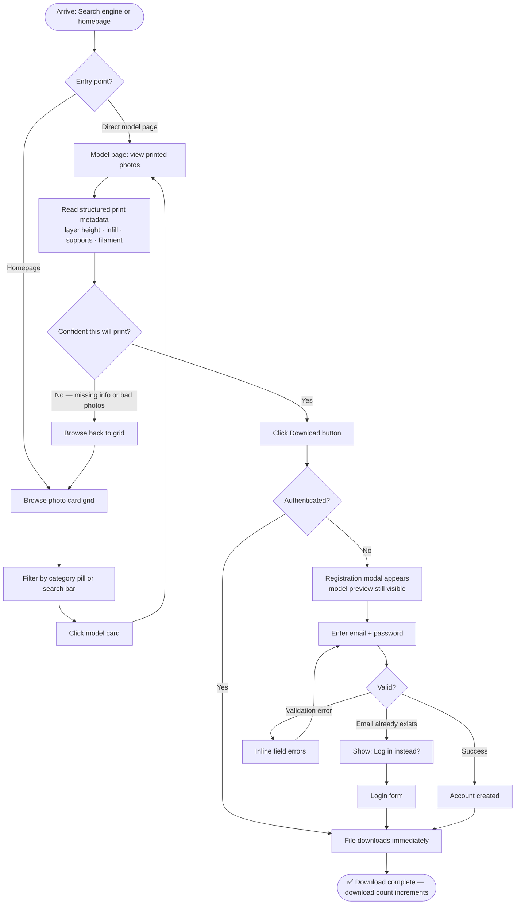
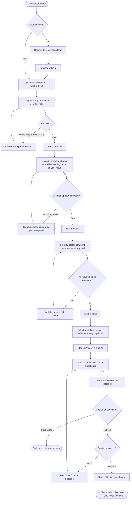
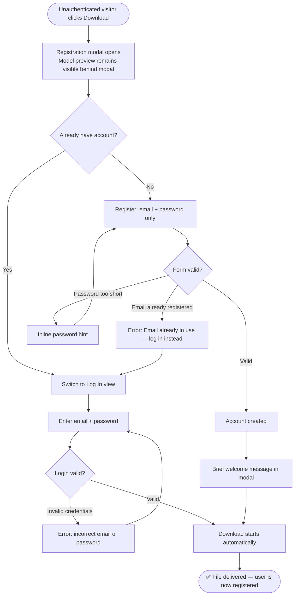

# User Journey Flows

## Journey 1: Consumer Discovery & Download (Maya's Happy Path)

## Journey 2: Creator Upload & Publish (Tomas's Happy Path)

## Journey 3: Registration Gate (Conversion Moment)

## Journey Patterns

**Navigation patterns:**
- Every journey has a single clear entry point and a single success state — no ambiguous endings
- Back navigation always returns to the browse context, never to a blank or dead-end state
- Wizard steps are linear but resumable via Save Draft — abandonment does not mean lost work

**Decision gate patterns:**
- **Soft gates** (missing metadata, incomplete fields): show inline errors and let the user fix in place — never block the whole step with a full-page error
- **Hard gates** (auth required to download, photo required to publish): always explain the reason at the point of blocking, never just refuse silently

**Feedback patterns:**
- **Inline / immediate:** field-level validation errors appear at the point of incorrect input
- **Step-level:** wizard progress indicator always visible; user knows where they are in 5 steps
- **Action confirmation:** toast notification + redirect on publish; auto-download trigger on register+download

**Error recovery patterns:**
- Every error state is specific and actionable — no "something went wrong" dead ends
- "Email already registered" errors offer a direct path to login rather than a dead end
- Storage/upload errors on publish return the user to the preview step, not the beginning

## Flow Optimization Principles

1. **Success path is always the shortest path** — happy path has no unnecessary stops; branches add steps only when unavoidable
2. **Block late, not early** — validation errors surface at the moment of attempted progress, not on field blur or premature form submission
3. **Show the model behind every gate** — registration modal and auth prompts keep the model visible; the user always knows what they are about to get
4. **Wizard steps are resumable** — Save Draft means abandonment is not failure; creators can continue across sessions
5. **Automatic actions after conversion** — after registration, download starts automatically; no "now click download again" friction step
